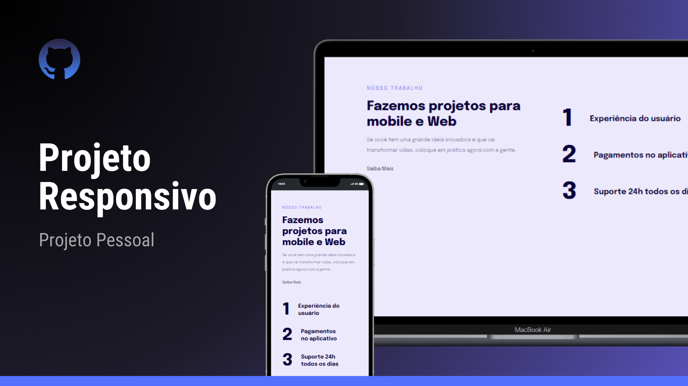

<h1 align="center"> Projeto Responsividade </h1>

  <a href="#-tecnologias">Tecnologias</a>&nbsp;&nbsp;&nbsp;|&nbsp;&nbsp;&nbsp;
  <a href="#-projeto">Projeto</a>&nbsp;&nbsp;&nbsp;|&nbsp;&nbsp;&nbsp;
  <a href="#-layout">Layout</a>&nbsp;&nbsp;&nbsp;|&nbsp;&nbsp;&nbsp;
  <a href="#memo-licença">Licença</a>
  

  

 

  

## 🚀 Tecnologias

Esse projeto foi desenvolvido com as seguintes tecnologias:

- HTML e CSS
- Git e Github
- Figma

## 💻 Projeto

O projeto Responsividade foi criado com o objetivo de se adequar a versão mobile e desktop de dispostivos web.

- [Acesse o projeto finalizado (online). ](https://silverioesantos.github.io/responsividade/)

## 🔖 Layout

Você pode visualizar o layout base do projeto através [DESSE LINK](https://www.figma.com/file/ZeSxTa9oQGtCuqsoceEYLw/Projeto-Responsivo?type=design&t=jicJwa1a3ErcJdbr-6). É necessário ter conta no [Figma](https://figma.com) para acessá-lo.

## :memo: Licença

Esse projeto está sob a licença MIT.
